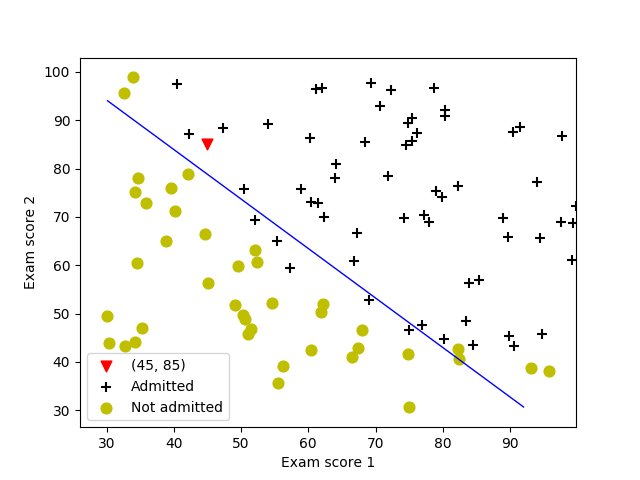

# LogisticRegression

## Introduction
In this exercise, you will implement logistic regression and apply it to two
different datasets. Before starting on the programming exercise, we strongly
recommend watching the video lectures and completing the review questions
for the associated topics.

To get started with the exercise, you will need to download the starter
code and unzip its contents to the directory where you wish to complete the
exercise. If needed, use the cd command in Octave/MATLAB to change to
this directory before starting this exercise.
You can also find instructions for installing Octave/MATLAB in the “En-
vironment Setup Instructions” of the course website.

**WARNING**

Code was implemented on ~~Octave/MATLAB~~ Python 3.5.4 with libraries *numpy* **(1.13.3)** *pandas* **(0.22.0)** *matplotlib* **(2.1.1)**

Before starting to implement any learning algorithm, it is always good to
visualize the data if possible. In the first part, the code will load the
data and display it on a 2-dimensional plot by calling the function plotData.
You will now complete the code in plotData so that it displays a figure
like Figure 1, where the axes are the two exam scores, and the positive and
negative examples are shown with different markers.

## Implementation

Your first step is to implement this function in sigmoid.m so it can be
called by the rest of your program. When you are finished, try testing a few
values by calling sigmoid(x). For
large positive values of x, the sigmoid should be close to 1, while for large
negative values, the sigmoid should be close to 0. Evaluating sigmoid(0)
should give you exactly 0.5. Your code should also work with vectors and
matrices. For a matrix, your function should perform the sigmoid
function on every element.

## Learning parameters

In the previous assignment, you found the optimal parameters of a linear regression model by implementing gradent descent. You wrote a cost function
and calculated its gradient, then took a gradient descent step accordingly.
This time, instead of taking gradient descent steps, you will use an 
**scipy** function called **minimize**

After learning the parameters, you can use the model to predict whether a
particular student will be admitted. For a student with an Exam 1 score
of 45 and an Exam 2 score of 85, you should expect to see an admission
probability of 0.776.
Another way to evaluate the quality of the parameters we have found
is to see how well the learned model predicts on our training set.

